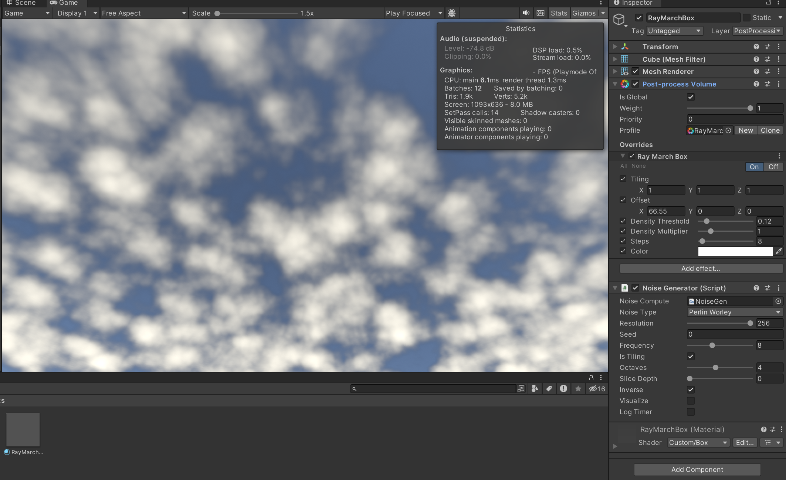

# CloudPro —— 基于 Unity 的体积云渲染实战（开发中）

## Step1. 噪声生成

## Step2. 初步可视化云层

## Reference

* The Real-time Volumetric Cloudscapes of Horizon: Zero Dawn [Advances in Real-Time Rendering- SIGGRAPH 2015](https://advances.realtimerendering.com/s2015/index.html)
* SebLague 的 Coding Adventure 系列之 Clouds https://github.com/SebLague/Clouds
* 知乎教程：[RayMarching实时体积云渲染入门](https://zhuanlan.zhihu.com/p/248406797)

